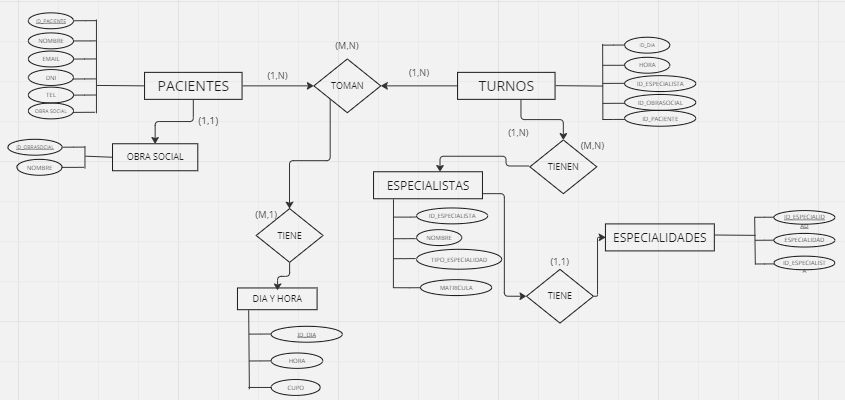
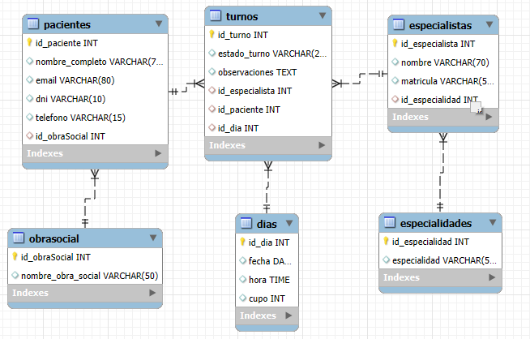
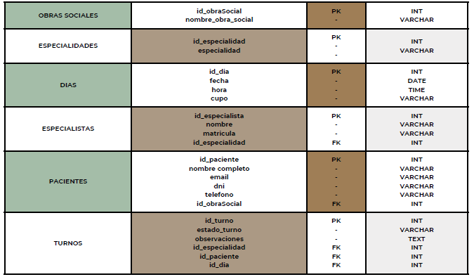

# Proyecto Final - SQL
## Comision - 59410
## Alumna: Dominguez Estefania


# Base de Datos `alta_turnos`
# Modelo de Negocio: Sistema de Gestión de Turnos en Salud Mental - 

Descripción del Proyecto: Alta es una institución dedicada a brindar atención endiversas 
especialidades dentro del ámbito de la salud mental. Reconocemos que la gestión eficiente 
de los turnos es crucial para garantizar un servicio de calidadtanto para nuestros pacientes como para nuestros especialistas.

# Problematica a resolver
Actualmente, la gestión de turnos implica un esfuerzo significativo por parte de laadministración, 
que debe buscar manualmente la disponibilidad de los días,verificar la compatibilidad con los horarios 
de los pacientes y especialistas, yconfirmar cada turno individualmente. Este proceso no solo es ineficiente, 
sino que también aumenta el riesgo de errores, retrasos y pérdida de tiempo,afectando la experiencia del paciente.


# Objetivo
Nuestro objetivo, es automatizar todo el proceso de gestión de turnos,permitiendo que el sistema 
registre la disponibilidad de los especialistas, gestione la agenda de los pacientes, y organice los 
turnos de forma optimizada. La administración se limitará únicamente a la tarea de validar y enviar las 
confirmaciones de turno, reduciendo su carga operativa y permitiendo una mayor dedicación a otras tareas críticas.

Este sistema facilitara el acceso a reportes en tiempo real, el seguimiento de la ocupacion de los
especialistas, y la identificación de patrones que permitan mejorar la calidad del servicio.


## Diagrama entidad-relacion



## Modelo de esquerma de tablas



 ## Modelo de esquerma de tablas




## *OBJETOS*

## Funciones

### `paciente_turno_swiss_medical()`
Esta función devuelve el nombre del primer paciente con un turno confirmado de la obra social *Swiss Medical*.

**Ejemplo de uso:**
```sql
SELECT paciente_turno_swiss_medical();
```
Este ejemplo retorna un nombre de paciente cuya obra social es *Swiss Medical* y tiene un turno en estado 'Confirmado'.

### `especialista_disponible_lunes()`
Devuelve el nombre del primer especialista disponible los días lunes, donde aún quedan cupos.

**Ejemplo de uso:**
```sql
SELECT especialista_disponible_lunes();
```
Este ejemplo retornará el nombre de un especialista con disponibilidad un día lunes.

## Vistas

### `obra_social_mas_turnos`
Esta vista muestra la obra social que tiene más turnos registrados.

**Ejemplo de uso:**
```sql
SELECT * FROM obra_social_mas_turnos;
```
Este ejemplo mostrará una lista con el nombre de cada obra social y el total de turnos registrados por cada una.

### `dia_mayor_cantidad_turnos`
Muestra el día con mayor cantidad de turnos tomados.

**Ejemplo de uso:**
```sql
SELECT * FROM dia_mayor_cantidad_turnos;
```
Este ejemplo retornará una lista de días y la cantidad de turnos asociados a cada fecha.

## Procedimientos

## `insertar_nuevo_paciente()`
Inserta un nuevo paciente en la base de datos.

**Parámetros:**
- `nombre_completo`
- `email`
- `dni`
- `telefono`
- `id_obraSocial`

**Ejemplo de uso:**
```sql
CALL insertar_nuevo_paciente('vero giachino', 'vero.g@gmail.com', '12345678', '1122334455', 1);
```

### `listar_todos_los_turnos()`
Este procedimiento devuelve una lista de todos los turnos, incluyendo el nombre del pac

**Ejemplo de uso:**
```sql
CALL listar_todo_los_turnos();
```

### `listar_turnos_confirmados()`
Devuelve todos los turnos que están en estado "Confirmado".

**Ejemplo de uso:**
```sql
CALL listar_turnos_confirmados();
```
Este ejemplo mostrará una lista de turnos confirmados con el nombre del paciente, nombre del especialista y estado del turno.

## Triggers

### `after_turno_insert`
Este trigger se activa después de insertar un nuevo turno. Cada vez que se inserta un turno, se almacena un registro en la tabla `turnos_audit` para auditar los cambios.

**Estructura de la tabla de auditoría:**
```sql
CREATE TABLE alta_turnos.turnos_audit (
    id INT NOT NULL AUTO_INCREMENT PRIMARY KEY,
    id_turno INT,
    fecha TIMESTAMP DEFAULT CURRENT_TIMESTAMP
);
```

### `after_turno_insert_update_cupo`
Este trigger se activa después de insertar un nuevo turno y actualiza el cupo de la tabla `dias`, reduciendo el cupo disponible por cada turno reservado.

**Ejemplo de uso:**
```sql
INSERT INTO alta_turnos.turnos (id_paciente, id_especialista, id_dia, estado_turno)
VALUES (1, 2, 3, 'Confirmado');
```

## Transacciones

Inserta un nuevo paciente y asignarle un turno
```sql
INSERT INTO alta_turnos.pacientes(nombre_completo, email, dni, telefono, id_obraSocial)
VALUES ('vero giachino', 'vero.g@gmail.com', '12345678', '56466546', 5) ;

INSERT INTO alta_turnos.turnos(estado_turno, observaciones, id_especialista, id_paciente, id_dia)
VALUES ('Confirmado', 'Turno confirmado', 1, 1, 1);
```
Usando COMMIT agrego los cambios, de lo contrario, con ROLLBACK, se deshacen

## Roles

Crea un usuario y solo le da acceso a la insercion de cupos y agregar pacientes de manera manual
```sql
GRANT SELECT, INSERT ON alta_turnos.dias TO 'estefania_d'@'%';
GRANT SELECT, INSERT ON alta_turnos.pacientes TO 'estefania_d'@'%';
```
Usuario con solo permisos de lectura de la tabla turnos
```sql
GRANT SELECT ON alta_turnos.dias TO 'camila.ceballos'@'%';

```


